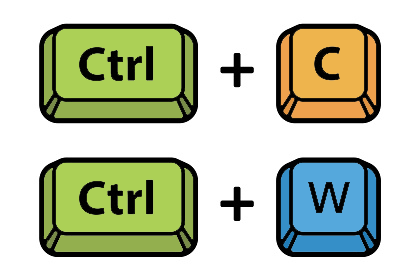

    

  <h1 align="center">Copy-Waste</h3>

  

    Copy Waste is a Software Systems Engineering Capstone project by Nolan Flegel, Rishabh Prasad, and William Peers.
  

## Commercial
Watch our commercial by clicking [here](https://www.youtube.com/watch?v=nW5Q-jcULXU) to get a brief look into out project.

## Project Background
Mismanagement of recyclable waste is an environmental disaster and a burden on society. Recycling is an inefficient, costly and risky process. This project’s purpose is to increase recycling collection rates while also reducing risks for waste management workers and costs for municipalities.We intend to accomplish this goal through three deliverables:

1. Universal Waste Bin Detector
2. Green Screen: Waste Management Dashboard
3. Detecting Rare and Severe Contaminants through Copy-Paste Data Augmentation

## Business Need / Opportunity
Our goal is to develop a product which is able to detect rare and severe contamination in recycling for waste management companies and municipalities. Although they are uncommon, they present safety hazards to workers as well as contaminate recycling. In conjunction with political movements demanding more drastic action on environmental impacts and waste, this project can be used to help society achieve that objective through automation of waste collection facilities.

## Project Deliverables

Universal Bin Detector

The bin detector aims to improve the efficiency of recycling bin detection and allow for rapid scalability of the recycling collection to additional municipalities. This is achieved by creating an object detection model that can be deployed to any waste collection vehicle. 

Green Screen: Waste Management Dashboard

The dashboard strives to build an interactive platform which provides residential recycling collection data analytics and insights to municipalities and stakeholders. Increasing the availability of this information allows the municipality to strategize and evaluate recycling information to reduce costs and inefficiencies.

Copy-Paste Rare Contaminant Detection Pipeline

Finally, through data augmentation, this project also focuses on detecting rare and severe contaminants which are currently undetectable. Although these contaminants occur rarely in residential recycling, they are critical to detect as they pose serious risks to waste collection workers and surrounding properties. This data augmentation pipeline will be able to generate artificial image datasets of rare contaminants from a few sample images. Our objective is to train machine learning models using the augmented dataset to detect an object which was previously undetectable and mitigate risks. 

*Click the above points to learn more about each deliverable*

## Documentation

All of our detailed documentation can be found [here](https://github.com/Copy-Waste/cw-core/tree/main/Documentation). Some key documents specific to our capstone class can be directly reached from the links below.

### ENSE 400

- [Business Case](https://github.com/Copy-Waste/cw-core/blob/main/Documentation/1%20-%20Planning/Business%20Case.pdf)
- [Project Charter](https://github.com/Copy-Waste/cw-core/blob/main/Documentation/1%20-%20Planning/Project%20Charter.pdf)
- [Problem & Requirements Prerequisites](https://github.com/Copy-Waste/cw-core/blob/main/Documentation/1%20-%20Planning/Project%20Requirements.pdf)
- [System / Architectural Design](https://github.com/Copy-Waste/cw-core/tree/main/Documentation/6%20-%20Prototypes%20and%20Diagrams)
- Prototypes / Wireframes
  - [Lo-Fi Diagrams](https://github.com/Copy-Waste/cw-core/tree/main/Documentation/6%20-%20Prototypes%20and%20Diagrams/Dashboard%20-%20Lo-Fi%20Diagrams)
  - [Hi-Fi Diagrams](https://github.com/Copy-Waste/cw-core/tree/main/Documentation/6%20-%20Prototypes%20and%20Diagrams/Dashboard%20-%20Hi-Fi%20Diagrams)
- [Role/Attribute-based Access Control](https://github.com/Copy-Waste/cw-core/blob/main/Documentation/8%20-%20Testing%20and%20Quality/RBAC%20Vision.pdf)
- Project Roadmaps
  - [Kanban Board Snapshots](https://github.com/Copy-Waste/cw-core/tree/main/Documentation/1%20-%20Planning/Trello%20Boards)
  - [Gantt Chart](https://github.com/Copy-Waste/cw-core/blob/main/Documentation/2%20-%20Scheduling/Gantt%20Chart.pdf)
  - [User Story Map](https://github.com/Copy-Waste/cw-core/blob/main/Documentation/2%20-%20Scheduling/User%20Story%20Map.pdf)
- Video blogs
  - [Vlog 1](https://youtu.be/U14Ei5zRgFo)
  - [Vlog 2](https://youtu.be/TKc6Ga1Qyq4)
  - [Vlog 3](https://youtu.be/pZszo4uhcGo)

### ENSE 477

- Project Source Code
  - [Green Screen Dashboard](https://github.com/proboticsinc/streamsight/tree/10-29-CopyWaste)
  - [Universal Bin Detector](https://github.com/proboticsinc/ur-copy-waste/tree/master/bin-tip-detector)
  - [Copy Waste Data Augmentation](https://github.com/proboticsinc/ur-copy-waste/tree/master/copy-waste)
- [Code Testing Plan / Results](https://github.com/Copy-Waste/cw-core/blob/main/Documentation/8%20-%20Testing%20and%20Quality/Code%20Testing%20-%20Plan%20and%20Results.pdf)
- [User Testing Plan / Results](https://github.com/Copy-Waste/cw-core/blob/main/Documentation/8%20-%20Testing%20and%20Quality/User%20Testing%20-%20%20Plan%20and%20Results.pdf)
- [Code Quality Review Report](https://github.com/Copy-Waste/cw-core/blob/main/Documentation/9%20-%20Project%20Closing/Code%20Quality%20Review.pdf)
- [Project Poster](https://github.com/Copy-Waste/cw-core/blob/main/Project%20Day/Project%20Poster.pdf)
- Video Blogs
  - [Vlog 4](https://youtu.be/ADXtTtiVm4w)
  - [Vlog 5](https://youtu.be/1DTdelKtWiw)
- [Project Commercial](https://www.youtube.com/watch?v=nW5Q-jcULXU)
- [Knowledge Base](https://github.com/Copy-Waste/cw-core/tree/main/Documentation/9%20-%20Project%20Closing/Knowledge%20Base)
  - [Green Screen Dashboard - User Training](https://github.com/Copy-Waste/cw-core/blob/main/Documentation/9%20-%20Project%20Closing/Knowledge%20Base/Dashboard%20User%20Training.pdf)
  - [Green Screen Dashboard - Developer Readme](https://github.com/Copy-Waste/cw-core/blob/main/Documentation/9%20-%20Project%20Closing/Knowledge%20Base/Green%20Screen%20Dashboard%20-%20README.md)
  - [Copy Waste Data Augmentation - Developer Readme](https://github.com/Copy-Waste/cw-core/blob/main/Documentation/9%20-%20Project%20Closing/Knowledge%20Base/Copy%20Waste%20Data%20Augmentation%20-%20README.md)
  - [Universal Bin Detector - Developer Readme](https://github.com/Copy-Waste/cw-core/blob/main/Documentation/9%20-%20Project%20Closing/Knowledge%20Base/Universal%20Bin%20Detector%20-%20README.md)
- Final Presentation
- Project Experience Report

## Demos

- [Watch the Green Screen Dashboard Demo here](https://youtu.be/NqiuXiez3qs)
- [Watch the Universal Bin Detector Demo here](https://youtu.be/K-p7Ay8yws8)

## Vlogs

1. Project Introduction Vlog - [Video](https://youtu.be/U14Ei5zRgFo) | [Script](https://github.com/Copy-Waste/cw-core/blob/main/Vlogs/Vlog%201/Introduction%20Script.pdf) | [Slides](https://github.com/Copy-Waste/cw-core/blob/main/Vlogs/Vlog%201/Introduction%20Presentation.pdf)

2. Vlog 2 - [Video](https://youtu.be/TKc6Ga1Qyq4) | [Script](https://github.com/Copy-Waste/cw-core/blob/main/Vlogs/Vlog%202/Vlog%202%20-%20Script.pdf) | [Slides](https://github.com/Copy-Waste/cw-core/blob/main/Vlogs/Vlog%202/Vlog%202%20-%20Presentation.pdf)

3. Vlog 3 - [Video](https://youtu.be/pZszo4uhcGo) | [Script](https://github.com/Copy-Waste/cw-core/blob/main/Vlogs/Vlog%203/Vlog%203%20-%20Script.pdf) | [Slides](https://github.com/Copy-Waste/cw-core/blob/main/Vlogs/Vlog%203/Vlog%203%20-%20Presentation.pdf)

4. Vlog 4 - [Video](https://youtu.be/ADXtTtiVm4w) | [Script](https://github.com/Copy-Waste/cw-core/blob/main/Vlogs/Vlog%204/Vlog%204%20-%20Script.pdf) | [Slides](https://github.com/Copy-Waste/cw-core/blob/main/Vlogs/Vlog%204/Vlog%204%20-%20Presentation.pdf)

5. Vlog 5 - [Video](https://youtu.be/1DTdelKtWiw) | [Script](https://github.com/Copy-Waste/cw-core/blob/main/Vlogs/Vlog%205/Vlog%205%20-%20Script.pdf) | [Slides](https://github.com/Copy-Waste/cw-core/blob/main/Vlogs/Vlog%205/Vlog%205%20-%20Presentation.pdf)

## Acknowledgements

- University of Regina
- Dr. Mohamed El-Darieby
- Dr. Timothy Maciag
- Trevor Douglas
- George Daoud
- [Simple Copy-Paste for Instance Segmentation](https://arxiv.org/pdf/2012.07177.pdf)
- [Mitacs](https://www.mitacs.ca/en)

## References

- Aral, R., Keskin, Ş., Kaya, M., Hacıömeroğlu, M. (2018). Classification of TrashNet Dataset Based on Deep Learning Models. 2018 IEEE International Conference on Big Data. https://doi.org/10.1109/BigData.2018.8622212

- Bolya, D., Zhou, C., Xiao, F., Jae Lee, Y. (2020). YOLACT++: Better Real-time Instance Segmentation. IEEE Transactions on Pattern Analysis and Machine Intelligence 2020 Aug 5. https://doi.org/10.1109/tpami.2020.3014297.

- Buric, M., Pobar, M., Ivasic-Kos, M. (2018). Ball Detection Using Yolo and Mask R-CNN. 2018 International Conference on Computational Science and Computational Intelligence (CSCI). https://doi.org/10.1109/CSCI46756.2018.00068.

- Deloitte Canada. (2019) Economic Study of the Canadian Plastics Industry, Market and Waste. https://publications.gc.ca/site/eng/9.871296/publication.html.

- Dvornik, N., Mairal, J., Schmid, C. (2018), Modeling Visual Context is Key to Augmenting Object Detection Datasets, 15th ECCV 2018: Munich, Germany - Volume 12. https://arxiv.org/abs/1807.07428. 

- Ghiasi, G., Cui, Y., Srinivas, A., Qian, R., Lin, T., Cubuk, E., Le, Q., Zoph, B. (2021). Simple Copy-Paste is a Strong Data Augmentation Method for Instance Segmentation. arXiv, https://arxiv.org/abs/2012.07177v2.

- Proença, P., & Simões, P. (2020). TACO: Trash Annotations in Context for Litter Detection. arXiv. https://arxiv.org/abs/2003.06975

- Jainuddin, A., Hou, Y., Baharuddin, M., Yussof. S. (2020). Performance Analysis of Deep Neural Networks for Object Classification with Edge TPU. 2020 8th International Conference on Information Technology and Multimedia (ICIMU). https://doi.org/10.1109/ICIMU49871.2020.9243367.

- Weiss, K., Khoshgoftaar, T.M. & Wang, D. (2016). A survey of transfer learning. J Big Data 3, 9 (2016). https://doi.org/10.1186/s40537-016-0043-6

- Zoph, B., Ghiasi, G., Lin, T., Cui, Y., Liu, H., Cubuk, E., E., Lej, Q. Rethinking Pre-training and Self-training. (2018) 34th Conference on Neural Information Processing Systems (NeurIPS 2020), Vancouver, Canada. https://arxiv.org/abs/2006.06882v2. 

- Adedeji, O., & Wang, Z. (2019). Intelligent Waste Classification System Using Deep Learning Convolutional Neural Network. Procedia Manufacturing, 35, 607-612. doi:10.1016/j.promfg.2019.05.086

- Thung, G., & Yang, M. (2017). Garythung/trashnet. Retrieved October 28, 2020, from https://github.com/garythung/trashnet

- US EPA, “An Analysis of Lithium-ion Battery Fires in Waste Management and Recycling,” EPA, USA, 2021. [Online]. Available: https://www.epa.gov/system/files/documents/2021-08/lithium-ion-battery-report-update-7.01_508.pdf